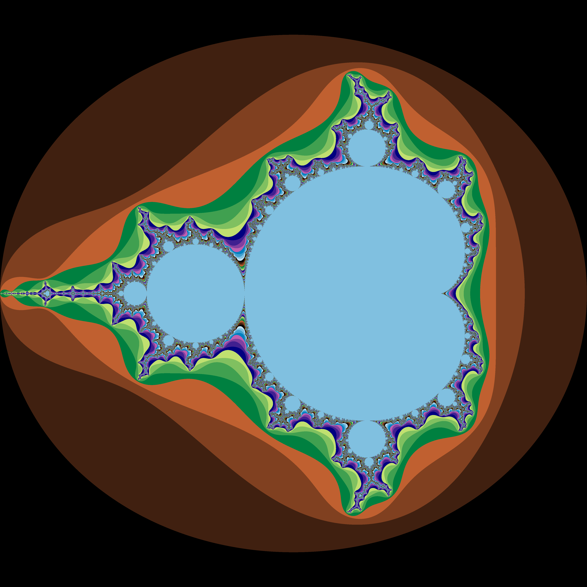

# rust-mandelbrot

## Rust dilinde yazılmış Mandelbrot serisi görselleştiricisi.

### [Şuradaki](https://www.geeksforgeeks.org/mandelbrot-fractal-set-visualization-in-python/) 2. Python örnek kodu baz alınarak Rust diline çevrilmiştir.

## Ekran Görüntüsü 

## Kullanım
    `cargo run --release`